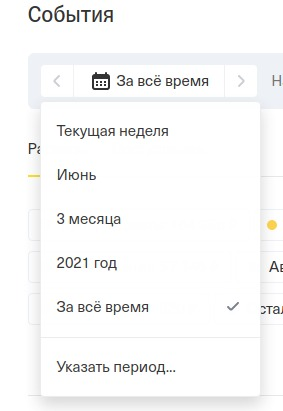
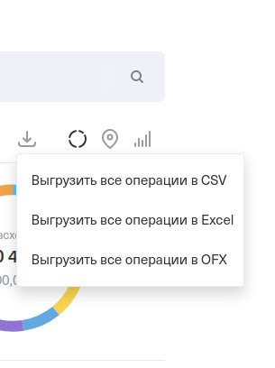

# Personal finance charts from Tinkoff info

## How to use

1. Open your personal Tinkoff [web-page](https://www.tinkoff.ru/).
2. Go to the account you want to analyze.
3. Choose the period you want to look at:



4. Download csv data about your account operations:



5. Create a new subfolder in `data` directory. Put csv file in this new subfolder.
E.g., I have debet, deposit and savings accounts. So I have the following structure:
```
├── data
│   ├── debet
│   │   └── operations.csv
│   ├── deposit
│   │   └── operations.csv
│   └── savings
│       └── operations.csv

```
6. Walk through the `charts.ipynb` notebook. It can draw your account stats through the `AccountData` class. It can also merge several classes together, so that you get a total overview of your budget.

